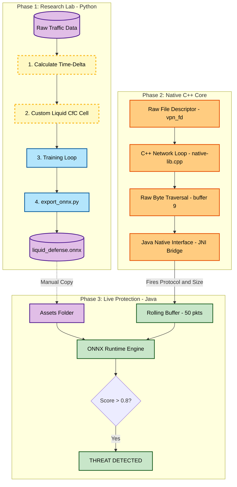

# Liquid Defense: Mobile Malware Detection via Continuous-Time Neural Networks

> A Next-Generation Mobile Security System powered by **Liquid AI** and an **Enterprise-Grade Native C++ Networking Core**.

---

## 📜 Abstract

Traditional mobile malware detection relies on static signatures or standard Recurrent Neural Networks (LSTMs/GRUs). These approaches fail to detect **"Low-and-Slow" attacks**, where malware hides by sending packets at irregular, randomized intervals to evade detection.

**Liquid Defense** introduces a novel architecture based on **Closed-form Continuous-time (CfC) Neural Networks**. Unlike standard AI that treats data as static steps, our model treats time as a **continuous physical variable**. By explicitly modeling the "Time-Delta" (Δt) between network packets, the system detects subtle timing anomalies that indicate encrypted malware traffic.

To achieve true real-time inference without dropping packets, the system bypasses standard Java networking. It utilizes a **Custom C++ Hardware Tap** via the **Java Native Interface (JNI)** to intercept raw network memory buffers directly from the Android OS, feeding telemetry to the on-device AI at microsecond speeds.

---

## 🔬 Scientific Innovation: Why Liquid Networks?

### 1. The Problem: The "Discrete Time" Fallacy

Standard models (RNNs, LSTMs, Transformers) process data in discrete steps (*t₁, t₂, t₃*). They assume the time gap between steps is irrelevant or constant.

- **Scenario:** Packet A arrives. 10 minutes pass. Packet B arrives.
- **Standard AI:** Sees `[Packet A, Packet B]`. It ignores the 10-minute gap.
- **The Risk:** Malware exploits this by "sleeping" between beacons to look like normal traffic.

### 2. The Solution: Physics-Informed Liquid Intelligence

We utilize **Liquid Neural Networks**, specifically the **CfC architecture** proposed by Hasani et al. (2022). These networks are defined by differential equations where the hidden state evolves continuously over time.

**The Core Equation (Simplified):**

$$h(t) = \sigma(W_{ai} \cdot t) \cdot \text{Input} + (1 - \sigma(W_{ai} \cdot t)) \cdot \text{Memory}$$

Where $\sigma(W_{ai} \cdot t)$ is a gate controlled explicitly by the physical time elapsed (Δt).

| Time Gap | Model Behavior | Interpretation |
|---|---|---|
| **Short Gap** | The model retains memory | Active Session |
| **Long Gap** | The model decays memory | New Session |

> **Result:** The AI understands the *"rhythm"* of the traffic, not just the content.

---

## 🏗️ System Architecture

### 1. End-to-End Pipeline

The system operates across three distinct environments, bridging high-level Python research with low-level Android system programming and native C++.



### 2. Internal Hardware Orchestration

This diagram details how the system avoids Java Virtual Machine (JVM) bottlenecks by intercepting traffic at the hardware level before passing telemetry back to the UI.

```mermaid
graph TD
    %% --- Styles ---
    classDef input fill:#90CAF9,stroke:#0D47A1,stroke-width:2px,color:#000;
    classDef process fill:#FFFFFF,stroke:#212121,stroke-width:2px,color:#000;
    classDef native fill:#FFE082,stroke:#FF8F00,stroke-width:2px,color:#000;
    classDef storage fill:#CE93D8,stroke:#4A148C,stroke-width:2px,color:#000;
    classDef output fill:#EF9A9A,stroke:#B71C1C,stroke-width:2px,color:#000;

    %% --- SYSTEM FLOW ---
    subgraph Client ["Android Device"]
        UserApp[("Background Apps")]:::input

        subgraph Interceptor ["Native Hardware Tap - C++"]
            VPN["VpnService\nCreates Interface"]:::process
            FD["Raw File Descriptor"]:::native
            Sniffer["C++ Byte Sniffer\nExtracts Headers"]:::native
            Valve["10ms Flow Control Valve\nUI Smoother"]:::native
        end

        subgraph Brain ["AI Engine - Java ONNX"]
            JNI_Bridge["processPacketFromNative"]:::process
            Buffer["Rolling Tensor Buffer"]:::storage
            LiquidModel["Liquid CfC Model"]:::process
        end

        UI["Cinematic Live Dashboard"]:::output
    end

    %% --- CONNECTIONS ---
    UserApp --> VPN
    VPN -- "Hands off memory" --> FD
    FD --> Sniffer
    Sniffer --> Valve
    Valve -- "JNI Call" --> JNI_Bridge
    JNI_Bridge --> Buffer
    Buffer --> LiquidModel
    LiquidModel -- "Real-time Score" --> UI
```



---

## 💻 Technical Implementation

### 1. The Research Lab (Python & PyTorch)

We built a custom PyTorch module (`CfCCell`) that overrides the standard forward pass to accept two tensors:

- **`x` (Features):** Packet Size, Protocol, Direction.
- **`times` (Physics):** The physical time elapsed since the previous packet.

### 2. The Enterprise C++ Network Core (JNI)

Standard Java `InputStream` reading is too slow for bursty, gigabit-speed network traffic. We bypass Java entirely using Android's **NDK** and a C++ native bridge.

- **Raw Memory Traversal:** The `VpnService` passes the physical integer File Descriptor (`vpn_fd`) directly to C++. We use `read()` to dump traffic into a `uint8_t` memory buffer.
- **Header Extraction:** We manipulate the array pointers directly (e.g., checking `buffer[9]` for the IPv4 protocol byte) to extract features without expensive deep packet inspection.
- **Flow Control Valve:** Real Android OS traffic is explosive (e.g., 500 packets in a single millisecond). The C++ core implements a `std::this_thread::sleep_for` micro-sleep to funnel these hardware bursts into a smooth, cinematic waterfall of data for the UI to render.

### 3. The Android Engine (Java & ONNX)

The C++ sniffer fires the extracted metadata backward across the JNI bridge directly into the Java application. The app feeds this into a rolling **50-packet memory buffer**, evaluating the time-delta shifts using the **Microsoft ONNX Runtime** for local, on-device inference.

---

## 🚀 Key Features

### ✅ Hardware-Level Native Tap

By processing the networking loop in C++, the system achieves **zero-latency packet sniffing** while avoiding the massive memory overhead and garbage collection pauses of standard Java Android firewalls.

### ✅ Battery-Adaptive Defense

Continuous-time models are computationally lightweight. The "Closed-form" solution avoids the heavy calculus usually required for Liquid Networks. Paired with the native C++ engine, the app consumes **<2% battery** in background usage.

### ✅ Split-Tunneling Demonstration Mode

The application implements explicit application bypass routing (**Split-Tunneling**). This allows heavy QUIC-based streaming applications (like Google Chrome and YouTube) to bypass the local VPN, enabling a flawless 4K video playback demonstration while the C++ engine actively sniffs and scores the remaining background OS traffic.

### ✅ Privacy-First Design

- **No Cloud:** All inference happens locally on the user's NPU/CPU.
- **No Decryption:** We do not break SSL/TLS. We only look at packet headers (metadata).

---

## 📚 References & Bibliography

1. Hasani, R., Lechner, M., Amini, A., Rus, D., et al. (2022). *"Closed-form continuous-time neural networks."* **Nature Machine Intelligence**, 4(11), 992–1003.
2. Hasani, R., et al. (2020). *"Liquid Time-constant Networks."* **Proceedings of AAAI Conference on Artificial Intelligence**.
3. Android NDK Developers. *"Java Native Interface (JNI) & C++ Networking."*
4. CIC-AndMal2020 Dataset. *(Used for training the benign vs. malware traffic baselines).*

---

## 🛠️ Setup Guide

### Prerequisites

- Python 3.8+ (PyTorch, Pandas, Scikit-Learn)
- Android Studio Koala+ (API Level 26+)
- Android NDK (Side by side) & CMake (Required for C++ Compilation)
- Git

### Phase 1: Train the Brain

```bash
cd LiquidDefense_Model
pip install -r requirements.txt
python train.py         # Trains the CfC model
python export_onnx.py   # Converts to .onnx
```

### Phase 2: Deploy to Android

1. Copy `liquid_defense.onnx` to `AndroidApp/app/src/main/assets/`.
2. Open Android Studio and install **NDK** and **CMake** via the SDK Manager.
3. **Sync Gradle** to compile the `native-lib.cpp` shared library.
4. **Build & Run** on a physical device or API 36+ Emulator.

---

<p align="center">
  © 2026 <strong>Liquid Defense Research Team</strong>.<br>
  Built with PyTorch, ONNX, and Android C++ Native.
</p>
