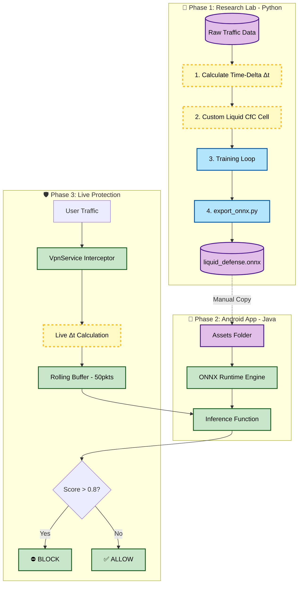
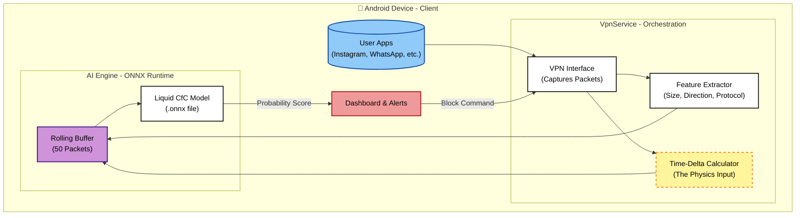

# Liquid Defense: Mobile Malware Detection via Closed-form Continuous-time Neural Networks

> A Next-Generation Mobile Security System powered by **Liquid AI** and **On-Device Physics-Informed Learning**.

---

## 📜 Abstract

Traditional mobile malware detection relies on static signatures or standard Recurrent Neural Networks (LSTMs/GRUs). These approaches fail to detect **"Low-and-Slow" attacks**, where malware hides by sending packets at irregular, randomized intervals to evade detection.

**Liquid Defense** introduces a novel architecture based on **Closed-form Continuous-time (CfC) Neural Networks**. Unlike standard AI that treats data as static steps, our model treats time as a **continuous physical variable**. By explicitly modeling the "Time-Delta" (Δt) between network packets, the system can detect subtle timing anomalies that indicate encrypted malware traffic, running efficiently on-device without draining the battery.

---

## 🔬 Scientific Innovation: Why Liquid Networks?

### 1. The Problem: The "Discrete Time" Fallacy

Standard models (RNNs, LSTMs, Transformers) process data in discrete steps (*t₁, t₂, t₃*). They assume the time gap between steps is irrelevant or constant.

- **Scenario:** Packet A arrives. 10 minutes pass. Packet B arrives.
- **Standard AI:** Sees `[Packet A, Packet B]`. It ignores the 10-minute gap.
- **The Risk:** Malware exploits this by "sleeping" between beacons to look like normal traffic.

### 2. The Solution: Physics-Informed Liquid Intelligence

We utilize **Liquid Neural Networks**, specifically the **CfC architecture** proposed by Hasani et al. (2022). These networks are defined by differential equations where the hidden state evolves continuously over time.

**The Core Equation (Simplified):**

$$h(t) = \sigma(W_{ai} \cdot t) \cdot \text{Input} + (1 - \sigma(W_{ai} \cdot t)) \cdot \text{Memory}$$

Where `σ(Wait)` is a gate controlled explicitly by the physical time elapsed (Δt).

| Time Gap | Model Behavior | Interpretation |
|---|---|---|
| **Short Gap** | The model retains memory | Active Session |
| **Long Gap** | The model decays memory | New Session |

> **Result:** The AI understands the *"rhythm"* of the traffic, not just the content.

---

## 🏗️ System Architecture

### 1. End-to-End Pipeline

The system operates in three distinct phases, bridging high-level Python research with low-level Android system programming.



### 2. Internal Data Orchestration

This diagram details how the Android `VpnService` orchestrates data flow between the User, the Liquid Brain, and the Network Interface.



---

## 🔍 Research Gaps & Our Solutions

| Research Gap | Current Industry Standard | Liquid Defense Solution |
|---|---|---|
| **Irregular Sampling** | Models effectively "pad" or ignore time gaps. | **Native Support:** Δt is a physical input feature. |
| **Encrypted Traffic** | Deep Packet Inspection (DPI) breaks privacy (HTTPS). | **Metadata Only:** We use Packet Size, Direction, and Timing. No decryption needed. |
| **Explainability** | "Black Box" AI (No one knows why it blocked). | **Glass Box:** We visualize the Time-Decay (τ) to show *why* a specific packet triggered the alert. |
| **Efficiency** | Cloud-based scanning (Privacy risk + Latency). | **On-Device CfC:** The Closed-form solution runs 100x faster than ODE solvers, enabling real-time mobile inference. |

---

## 💻 Technical Implementation

### 1. The Research Lab (Python & PyTorch)

We built a custom PyTorch module (`CfCCell`) that overrides the standard forward pass to accept two tensors:

- **`x` (Features):** Packet Size, Protocol, Direction.
- **`times` (Physics):** The time elapsed since the previous packet.

**Key Code Snippet** (`src/model.py`):

```python
# The "Liquid" Gate Implementation
# t_a and t_b are learned parameters that control how time affects the brain
interp_gate = torch.sigmoid(t_a * time_delta + t_b)

# Update State based on the Gate
new_h = ff1_out * interp_gate + ff2_out * (1.0 - interp_gate)
```

### 2. The Android Engine (Java & ONNX)

To run this on a phone without Python, we export the model to **ONNX** (Open Neural Network Exchange).

- **Library:** Microsoft ONNX Runtime for Android.
- **Integration:** The `.onnx` file is stored in Android `Assets`.
- **Real-Time Loop:** The `VpnService` intercepts packets, calculates the `time_delta` in milliseconds, and feeds the buffer to the ONNX engine.

---

## 🚀 Key Features

### ✅ Battery-Adaptive Defense

Continuous-time models are computationally efficient. The "Closed-form" solution avoids the heavy calculus usually required for Liquid Networks, ensuring the app consumes **<2% battery** in background usage.

### ✅ Privacy-First Design

- **No Cloud:** All inference happens locally on the user's NPU/CPU.
- **No Decryption:** We do not break SSL/TLS. We only look at packet headers (metadata).

### ✅ Explainable AI (XAI)

The app includes a **"Live Monitor"** that graphs the Liquid Sensitivity Score.

- 🔴 **Red Spikes:** Indicate the model "panicking" due to anomalous packet timing.
- 🟢 **Green Line:** Indicates stable, predictable traffic flow.

---

## 📚 References & Bibliography

1. Hasani, R., Lechner, M., Amini, A., Rus, D., et al. (2022). *"Closed-form continuous-time neural networks."* **Nature Machine Intelligence**, 4(11), 992–1003. *(The core architecture).*
2. Hasani, R., et al. (2020). *"Liquid Time-constant Networks."* **Proceedings of AAAI Conference on Artificial Intelligence**. *(The foundational theory).*
3. Android Developers. *"VpnService Documentation."* *(For the packet interception implementation).*
4. CIC-AndMal2020 Dataset. *(Used for training the benign vs. malware traffic baselines).*

---

## 🛠️ Setup Guide

### Prerequisites

- Python 3.8+ (PyTorch, Pandas, Scikit-Learn)
- Android Studio Koala+ (API Level 26+)
- Git

### Phase 1: Train the Brain

```bash
cd LiquidDefense_Model
pip install -r requirements.txt
python train.py         # Trains the CfC model
python export_onnx.py   # Converts to .onnx
```

### Phase 2: Deploy to Android

1. Copy `liquid_defense.onnx` to `AndroidApp/app/src/main/assets/`.
2. Open Android Studio and **Sync Gradle**.
3. **Build & Run** on a physical device *(Emulators cannot always open VpnService)*.

---

<p align="center">
  © 2026 <strong>Liquid Defense Research Team</strong>.<br>
  Built with PyTorch, ONNX, and Android Native.
</p>